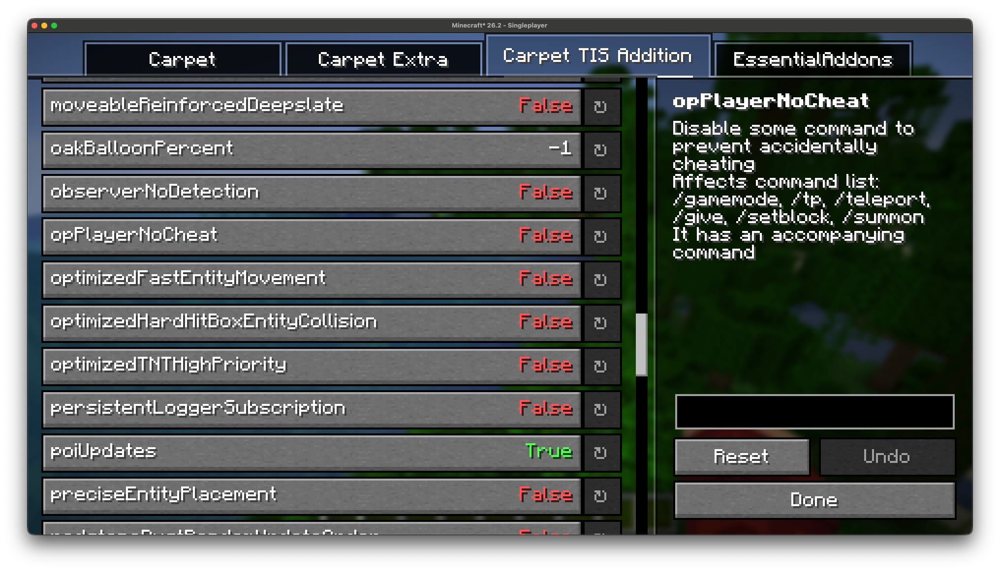

#  EssentialClient

[![Modrinth downloads](https://img.shields.io/modrinth/dt/essentialclient?label=Modrinth%20downloads&logo=data:image/svg+xml;base64,PHN2ZyB4bWxucz0iaHR0cDovL3d3dy53My5vcmcvMjAwMC9zdmciIHhtbDpzcGFjZT0icHJlc2VydmUiIGZpbGwtcnVsZT0iZXZlbm9kZCIgc3Ryb2tlLWxpbmVqb2luPSJyb3VuZCIgc3Ryb2tlLW1pdGVybGltaXQ9IjEuNSIgY2xpcC1ydWxlPSJldmVub2RkIiB2aWV3Qm94PSIwIDAgMTAwIDEwMCI+PHBhdGggZmlsbD0ibm9uZSIgZD0iTTAgMGgxMDB2MTAwSDB6Ii8+PGNsaXBQYXRoIGlkPSJhIj48cGF0aCBkPSJNMTAwIDBIMHYxMDBoMTAwVjBaTTQ2LjAwMiA0OS4yOTVsLjA3NiAxLjc1NyA4LjgzIDMyLjk2MyA3Ljg0My0yLjEwMi04LjU5Ni0zMi4wOTQgNS44MDQtMzIuOTMyLTcuOTk3LTEuNDEtNS45NiAzMy44MThaIi8+PC9jbGlwUGF0aD48ZyBjbGlwLXBhdGg9InVybCgjYSkiPjxwYXRoIGZpbGw9IiMwMGQ4NDUiIGQ9Ik01MCAxN2MxOC4yMDcgMCAzMi45ODggMTQuNzg3IDMyLjk4OCAzM1M2OC4yMDcgODMgNTAgODMgMTcuMDEyIDY4LjIxMyAxNy4wMTIgNTAgMzEuNzkzIDE3IDUwIDE3Wm0wIDljMTMuMjQgMCAyMy45ODggMTAuNzU1IDIzLjk4OCAyNFM2My4yNCA3NCA1MCA3NCAyNi4wMTIgNjMuMjQ1IDI2LjAxMiA1MCAzNi43NiAyNiA1MCAyNloiLz48L2c+PGNsaXBQYXRoIGlkPSJiIj48cGF0aCBkPSJNMCAwdjQ2aDUwbDEuMzY4LjI0MUw5OSA2My41NzhsLTIuNzM2IDcuNTE3TDQ5LjI5NSA1NEgwdjQ2aDEwMFYwSDBaIi8+PC9jbGlwUGF0aD48ZyBjbGlwLXBhdGg9InVybCgjYikiPjxwYXRoIGZpbGw9IiMwMGQ4NDUiIGQ9Ik01MCAwYzI3LjU5NiAwIDUwIDIyLjQwNCA1MCA1MHMtMjIuNDA0IDUwLTUwIDUwUzAgNzcuNTk2IDAgNTAgMjIuNDA0IDAgNTAgMFptMCA5YzIyLjYyOSAwIDQxIDE4LjM3MSA0MSA0MVM3Mi42MjkgOTEgNTAgOTEgOSA3Mi42MjkgOSA1MCAyNy4zNzEgOSA1MCA5WiIvPjwvZz48Y2xpcFBhdGggaWQ9ImMiPjxwYXRoIGQ9Ik01MCAwYzI3LjU5NiAwIDUwIDIyLjQwNCA1MCA1MHMtMjIuNDA0IDUwLTUwIDUwUzAgNzcuNTk2IDAgNTAgMjIuNDA0IDAgNTAgMFptMCAzOS41NDljNS43NjggMCAxMC40NTEgNC42ODMgMTAuNDUxIDEwLjQ1MSAwIDUuNzY4LTQuNjgzIDEwLjQ1MS0xMC40NTEgMTAuNDUxLTUuNzY4IDAtMTAuNDUxLTQuNjgzLTEwLjQ1MS0xMC40NTEgMC01Ljc2OCA0LjY4My0xMC40NTEgMTAuNDUxLTEwLjQ1MVoiLz48L2NsaXBQYXRoPjxnIGNsaXAtcGF0aD0idXJsKCNjKSI+PHBhdGggZmlsbD0ibm9uZSIgc3Ryb2tlPSIjMDBkODQ1IiBzdHJva2Utd2lkdGg9IjkiIGQ9Ik01MCA1MCA1LjE3MSA3NS44ODIiLz48L2c+PGNsaXBQYXRoIGlkPSJkIj48cGF0aCBkPSJNNTAgMGMyNy41OTYgMCA1MCAyMi40MDQgNTAgNTBzLTIyLjQwNCA1MC01MCA1MFMwIDc3LjU5NiAwIDUwIDIyLjQwNCAwIDUwIDBabTAgMjUuMzZjMTMuNTk5IDAgMjQuNjQgMTEuMDQxIDI0LjY0IDI0LjY0UzYzLjU5OSA3NC42NCA1MCA3NC42NCAyNS4zNiA2My41OTkgMjUuMzYgNTAgMzYuNDAxIDI1LjM2IDUwIDI1LjM2WiIvPjwvY2xpcFBhdGg+PGcgY2xpcC1wYXRoPSJ1cmwoI2QpIj48cGF0aCBmaWxsPSJub25lIiBzdHJva2U9IiMwMGQ4NDUiIHN0cm9rZS13aWR0aD0iOSIgZD0ibTUwIDUwIDUwLTEzLjM5NyIvPjwvZz48cGF0aCBmaWxsPSIjMDBkODQ1IiBkPSJNMzcuMjQzIDUyLjc0NiAzNSA0NWw4LTkgMTEtMyA0IDQtNiA2LTQgMS0zIDQgMS4xMiA0LjI0IDMuMTEyIDMuMDkgNC45NjQtLjU5OCAyLjg2Ni0yLjk2NCA4LjE5Ni0yLjE5NiAxLjQ2NCA1LjQ2NC04LjA5OCA4LjAyNkw0Ni44MyA2NS40OWwtNS41ODctNS44MTUtNC02LjkyOVoiLz48L3N2Zz4=)](https://modrinth.com/mod/essentialclient)

EssentialClient is a client-side mod that adds many client utilities as well as
providing a gui to modify carpet rules!

## Usage

This mod requires the fabric-launcher, fabric-api, fabric-kotlin, and
[YetAnotherConfigLib](https://modrinth.com/mod/yacl).

Optionally, you can install [fabric-carpet](https://modrinth.com/mod/carpet),
[mod-menu](https://modrinth.com/mod/modmenu), [ChunkDebug](https://modrinth.com/mod/chunk-debug),
and [Kursive](https://modrinth.com/mod/kursive).

Once installed, you can access the EssentialClient menu through mod-menu, or by
pressing the EssentialClient Menu keybind, which is `F7` by default and can be
changed in options.

From this menu you can:
- View and modify the EssentialClient settings.
- View and modify the Carpet server settings.
- Open the ChunkDebug map, provided you have ChunkDebug installed and are connected to a server which supports ChunkDebug.
- Open the Kursive scripting menu, provided you have Kursive installed.

EssentialClient's settings are saved to `./config/EssentialClient/config.json`.

## Carpet Client

EssentialClient lets you view and modify [carpet](https://github.com/gnembon/fabric-carpet)
rules through a gui instead of having to use the `/carpet` command.

You do not need to have carpet installed on your client for this to work. 
Opening the Carpet Server Settings menu will show you every rule, sorted by category,
with the rule's description and its extra info. Rules from carpet
extensions (such as carpet-extra or carpet-fixes) are also shown, separated by mod.

You must have permission to modify carpet rules on the server for your changes to
apply, otherwise the rules will just be displayed to you.

To get rule descriptions when playing on a server, EssentialClient downloads a rule
database which is cached in `./config/EssentialClient/carpet_rules.json`. A massive
thank you to RubixDev for creating his [carpet database](https://github.com/RubixDev/carpet-database)
which EssentialClient pulls from.

## Separate Mods

ChunkDebug and Kursive used to be features of EssentialClient but have since been
split into their own mods. You can still access both of them from the EssentialClient
menu, but they must be installed separately:

- [ChunkDebug](https://modrinth.com/mod/chunk-debug) lets you view the chunk loading
  status of all the chunks in a world, this requires the mod to be installed on the
  server as well.
- [Kursive](https://modrinth.com/mod/kursive) is the successor to EssentialClient's
  client-side scripting, letting you write and run scripts on your client.

If either mod is not installed then its button in the EssentialClient menu will be
disabled.

## Settings

All the settings below can be found in the EssentialClient settings menu, they are
split into the same categories that you will find in game.

### Gameplay

| Setting                              | Description                                                                                                                                                                                                          |
|--------------------------------------|----------------------------------------------------------------------------------------------------------------------------------------------------------------------------------------------------------------------|
| Auto Walk                            | 
 This will hold your forward key after you have held it for the set amount of ticks 
                                                                                                                           |
| Better Accurate Block Placement      | 
 This is the same as accurate block placement for tweakeroo but without the need for any server-side mods 
 
 This uses some packet hacking, which may flag anti-cheat on some servers 
                    |
| Crafting Hax                         | 
 Allows you to drop crafted recipes by holding control when crafting a recipe 
                                                                                                                                 |
| Sneak To Not Waterlog                | 
 Allows you to sneak when using a bucket on a waterloggable block to avoid waterlogging 
                                                                                                                       |
| Increase Spectator Scroll Speed      | 
 Increases the limit at which you can scroll to go faster in spectator 
                                                                                                                                        |
| Increase Spectator Scroll Sensitivity| 
 Increases the sensitivity at which you can scroll to go faster in spectator 
                                                                                                                                  |
| Tick Rate Affects Chat Key           | 
 Whether the tick rate affects your chat key, when true, with a lower tick rate it will take longer to open chat (vanilla behaviour) 
                                                                          |
| Fix MacOS Cursor Jumping             | 
 Fixes the position of where the cursor jumps in text boxes when holding command or option to be consistent with MacOS 
                                                                                        |
| Ignore Invalid Chat Messages         | 
 Ignores invalid chat messages and outputs them as system messages instead 
                                                                                                                                    |

### Technical

| Setting                  | Description                                                                                                             |
|--------------------------|-------------------------------------------------------------------------------------------------------------------------|
| Announce AFK             | 
 This announces when you become AFK after a set amount of time (in ticks) 
                                       |
| Announce AFK Message     | 
 This is the message you announce after you are AFK 
 
 Requires 'Announce AFK' to be enabled 
               |
| Announce Back Message    | 
 This is the message you announce after you are back from being AFK 
 
 Requires 'Announce AFK' to be enabled 
 |
| Carpet Always Set Default| 
 This makes it so whenever you set a carpet rule, it automatically sets it to default 
                            |
| Creative Walk Speed      | 
 This allows you to override the vanilla walk speed in creative mode 
                                            |
| Custom Time Out          | 
 This lets you change the amount of seconds until you timeout when connected to a server 
                        |
| Disable Hotbar Scrolling | 
 Prevents you from scrolling to use your hotbar, learn your keybinds! 
                                           |

### Rendering

| Setting                        | Description                                                                                            |
|--------------------------------|--------------------------------------------------------------------------------------------------------|
| Disable Armor Rendering        | 
 This allows you to disable armor rendering for the specified entities 
                         |
| Disable Damage Tilt            | 
 Disables the camera tilt effect when taking damage 
                                            |
| Disable Bossbar Rendering      | 
 This will disable any bossbars from rendering 
                                                 |
| Disable Display Text Rendering | 
 This will disable any display texts from rendering 
                                            |
| Disable Hand Swinging          | 
 Disables player hand swinging 
                                                                 |
| Disable Map Rendering          | 
 Disables maps in item frames from rendering 
                                                   |
| Disable Nametag Rendering      | 
 This disables all name tags from rendering 
                                                    |
| Disable Night Vision Flashing  | 
 Disables the flash that occurs when night vision is about to run out 
                          |
| Disable Recipe Toasts          | 
 Disables the recipe toast notifications from showing 
                                          |
| Disable Advancement Toasts     | 
 Disables the advancement toast notifications from showing 
                                     |
| Disable Tutorial Toasts        | 
 Disables the tutorial toast notifications from showing 
                                        |
| Disable Join/Leave Messages    | 
 This will prevent player join/leave messages from displaying 
                                  |
| Disable Screenshot Messages    | 
 Removes the message that pops up when you take a screenshot 
                                   |
| Display Play Time              | 
 Displays the amount of time your client has been running in the corner of the pause menu 
      |
| EssentialClient Button         | 
 This renders the EssentialClient Menu on the main menu screen and pause screen 
                |
| Ignore Server Render Distance  | 
 Ignores the server's render distance when rendering 
                                           |
| Lava Opacity                   | 
 Changes the opacity of lava 
                                                                   |
| Highlight Lava Sources         | 
 Changes the texture for lava sources to make them more visible 
                                |
| Highlight Water Sources        | 
 Changes the texture for water sources to make them more visible 
                               |
| Persistent Chat History        | 
 This prevents the chat from being cleared, also applies when changing worlds/servers 
          |
| Toggle Tab                     | 
 This allows you to toggle tab instead of holding it to see the tab menu 
                       |

### Miscellaneous

| Setting                   | Description                                        |
|---------------------------|----------------------------------------------------|
| Remove Warn Invalid Chunk | 
 Removes invalid chunk warnings from your logs 
 |

### Keybinds

These can be changed in the EssentialClient settings menu, or in the vanilla
controls screen under the EssentialClient category.

| Setting                     | Description                                                            |
|-----------------------------|------------------------------------------------------------------------|
| EssentialClient Menu Keybind| 
 This is the keybind to open the EssentialClient Menu 
          |
| Accurate Reverse Keybind    | 
 This is the keybind to activate reverse accurate block placement 
 |
| Accurate Into keybind       | 
 This is the keybind to activate into accurate block placement 
 |

## Contributing

If you have any issues or feature requests, feel free to open an
[issue](https://github.com/senseiwells/EssentialClient/issues).
Pull requests are also welcome.
